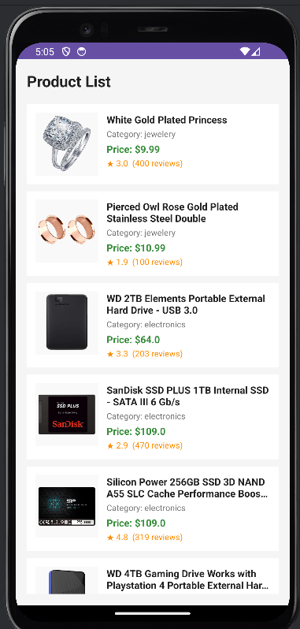
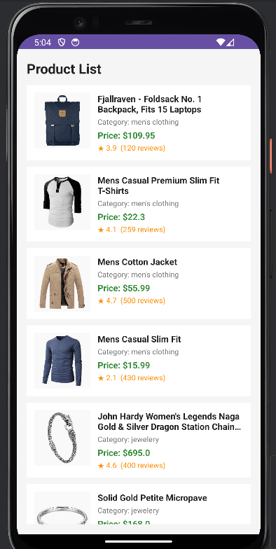

 # 📱 REST API Product List App

A simple Android application that fetches and displays product data from a REST API.

---

## 🚀 Features
- Fetch data from REST API (GET request)
- Parse JSON response
- Display products in a clean UI
- Show:
    - Product Image
    - Title
    - Category
    - Price
    - Rating & Reviews

---

## 🛠️ Technologies Used
- Java / Kotlin (Android)
- REST API (FakeStore API)
- JSON Parsing
- RecyclerView / ListView
- Glide/Picasso (for image loading)

---

## 🌐 API Used
👉 https://fakestoreapi.com/products

---

## 📸 Output Screenshots

### 🔹 Product List Screen



### 🔹 More Products


---

## 📂 Project Structure
restapiapp/
│── java/
│── res/
│── AndroidManifest.xml


---
## ▶️ How to Run

1. Clone the repository

```bash
git clone https://github.com/Akansha1425/YOUR_REPO_NAME.git
```
- Open in Android Studio
- Connect emulator or device
- Click Run ▶️
## Concept Used (Experiment 6)
- REST API Integration
- HTTP GET Request
- JSON Data Handling
- UI Rendering
##  Learning Outcome
- Understanding of REST API workflow
- Hands-on experience with JSON parsing
- Building real-time data-driven Android apps
## Author

- Akansha